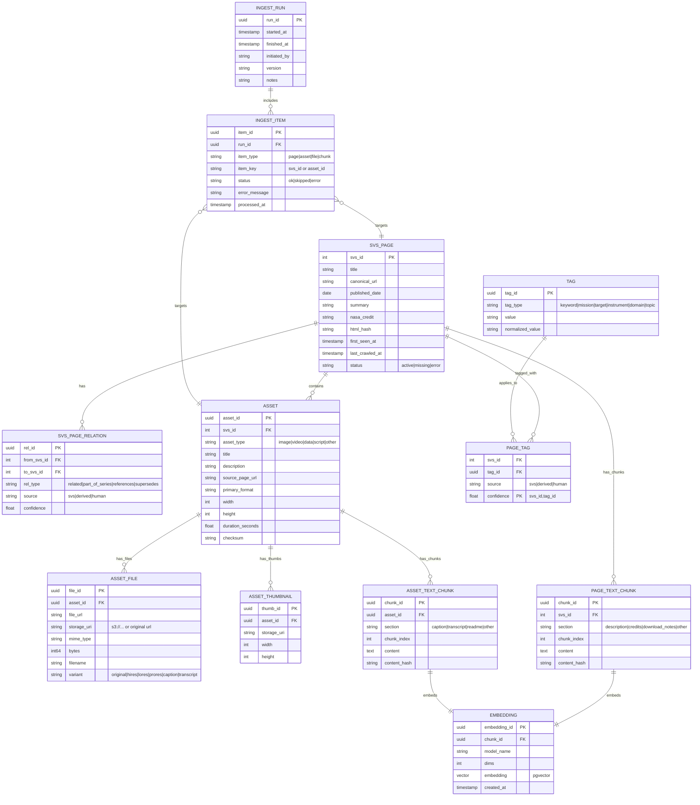
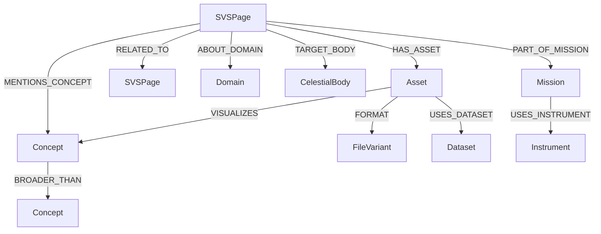

Below is a **Preliminary Design Review (PDR)**–level description for a **NASA Scientific Visualization Studio (SVS) Browser Web Application**, written for technical stakeholders, architects, and program managers. It is structured to support evolution into a CDR and implementation phase.

---
## NASA Scientific Visualization Studio (SVS) Knowledge Browser

### 1. Purpose and Objectives

The NASA Scientific Visualization Studio (SVS) hosts thousands of high-value scientific visualizations, imagery, videos, datasets, and explanatory narratives. While the content is rich, discoverability is limited due to minimal search and lack of cross-linking across scientific concepts, missions, datasets, and visualization products.

The objective of this project is to design and implement a **web-based SVS Browser** that:
- Ingests **all SVS resource pages and assets** (e.g., IDs like `5502`)
- Extracts and normalizes **structured metadata and unstructured documentation**
- Builds a **local, query-optimized database**
- Augments discovery using **RAG (Retrieval-Augmented Generation)** with a **knowledge graph**
- Supports **advanced semantic, scientific, and conversational queries**
- Is built on **open-source software**, but deployable and scalable on **AWS-supported internal services**
- Supports both **locally hosted and remotely hosted LLMs**

---
### 2. Scope

#### In Scope
- SVS front page and all resource pages listed in the provided CSV (through July 2025)
- All associated assets:
    - Images (PNG, JPG, TIFF)    
    - Videos (MP4, MOV) 
    - Animations
    - Captions, transcripts, and descriptive text
        
- Metadata ingestion and enrichment
- Search, browse, and AI-assisted discovery interfaces
- RAG + Knowledge Graph integration

#### Out of Scope (PDR Phase)
- Manual curation or editorial rewriting of SVS content    
- Replacement of the official SVS website
- Modification of original SVS assets

---

### 3. System Architecture Overview

**High-Level Architecture Layers**

1. **Ingestion & Crawling Layer**
2. **Data & Metadata Storage Layer**
3. **Knowledge Graph & Embedding Layer**
4. **RAG / LLM Reasoning Layer**
5. **Backend API Layer**
6. **Frontend Web Application**
7. **Deployment & Infrastructure Layer**

---

### 4. Ingestion & Metadata Extraction
#### 4.1 Source Inputs
- SVS page IDs from the uploaded CSV
- HTML pages (e.g., `https://svs.gsfc.nasa.gov/5502/`)
- Linked assets and downloadable files

#### 4.2 Crawling Strategy
- Use a **polite, rate-limited crawler**:
    - `Scrapy` or `Playwright` (for dynamic content)
        
- HTML parsing via:
    - `BeautifulSoup`  
    - `lxml`
        
#### 4.3 Metadata Extracted

For each SVS page:
- SVS ID
- Title
- Abstract / description
- Associated missions
- Scientific domains (e.g., heliophysics, planetary science)
- Keywords and tags
- Publication date
- Credits / authorship
- Related SVS pages
- Asset list (with formats, resolution, duration)

All metadata is normalized into a canonical schema.

---

### 5. Data Storage Layer
#### 5.1 Relational Metadata Store
**PostgreSQL (Open Source, AWS RDS-compatible)**
Used for:
- SVS page records
- Asset metadata
- Relationships between pages and assets
- Audit/versioning metadata

#### 5.2 Object Storage
**S3-compatible storage**
- AWS S3 (cloud)
- MinIO (local/dev

Stores:
- Asset files (or references to NASA-hosted originals)
- Extracted thumbnails
- Derived previews

---
### 6. Knowledge Graph & Embeddings

#### 6.1 Knowledge Graph
**Neo4j or Amazon Neptune (RDF/Property Graph)**
Nodes:
- SVS Page
- Asset
- Mission
- Instrument
- Planetary Body
- Scientific Concept
- Event (e.g., solar storm, eclipse)

Edges:

- _visualizes_
- _derived_from_
- _related_to_
- _part_of_mission_
- _references_concept_

This enables:
- Cross-domain discovery
- Relationship-driven exploration    
- Graph-enhanced RAG retrieval

#### 6.2 Vector Embeddings
- Use **sentence-transformer models** (e.g., `bge-large`, `e5-large`)
- Store embeddings in:
    - **pgvector** (Postgres)
    - or **FAISS** / **OpenSearch Vector**  

Embedded content includes:
- Page descriptions    
- Captions
- Transcripts
- Documentation text

---

### 7. RAG and LLM Integration
#### 7.1 RAG Pipeline
1. User query
2. Hybrid retrieval:
    - Keyword (Postgres)
    - Vector similarity
    - Knowledge graph traversal
3. Context assembly
4. LLM response generation with citations

#### 7.2 LLM Support

**Pluggable LLM Architecture**
Local:
- LLaMA 3
- Mistral
- Mixtral
- Phi-3

Remote:
- OpenAI
- Anthropic
- AWS Bedrockh

Frameworks:
- **LangChain** or **LlamaIndex**
- Custom graph-aware retrievers
    
---

### 8. Backend API Layer

**FastAPI (Python)**
Responsibilities:
- Query execution
- Graph traversal APIs
- RAG orchestration
- Authentication / authorization
    
- Asset metadata delivery
    

APIs:

- `/search`
- `/svs/{id}`
- `/assets/{id}`
- `/graph/explore`
- `/chat/query`

---
### 9. Frontend Web Application
#### 9.1 Stack
- **React / Next.js**
- TypeScript
- TailwindCSS
- D3.js / Cytoscape.js (graph visualization)

#### 9.2 Core Features
- Faceted search (domain, mission, planet, media type)
- SVS page explorer
- Asset preview gallery
- Interactive knowledge graph
- AI-assisted chat and guided discovery
- Deep linking back to official SVS pages

---
### 10. Deployment & Scalability
#### 10.1 Local / Dev
- Docker Compose
- MinIO
- Local LLM runtime (Ollama, vLLM)
    
#### 10.2 AWS / Internal Services
- ECS or EKS
- RDS (Postgres)
- OpenSearch (optional)
- Neptune or Neo4j Aura
- S3
- Bedrock (optional LLM backend)
    
#### 10.3 Scalability Considerations
- Horizontal API scaling
- Asynchronous ingestion jobs
- Caching (Redis)
- Offline embedding precomputation

---

### 11. Security & Compliance
- Read-only interaction with NASA-hosted content
- Attribution preservation
- IAM-based access control
- Audit logging for LLM queries
- Optional air-gapped deployment for internal use

---
### 12. Risks & Mitigations

|Risk|Mitigation|
|---|---|
|SVS HTML structure changes|Modular parsers, schema validation|
|LLM hallucinations|Citation-enforced RAG|
|Large asset volumes|Lazy loading + metadata-first design|
|Graph complexity|Tiered graph expansion|

---
### 13. Future Enhancements (Post-PDR)
- Automated scientific concept tagging
- Cross-linking with NASA DAACs
- Timeline-based visualization discovery
- User annotations and collections
- API exposure for downstream tools
    
--- 
### 14. Summary
This SVS Browser will transform the NASA Scientific Visualization Studio from a static archive into a **searchable, explorable, AI-augmented scientific knowledge system**, while preserving openness, attribution, and scalability across local and AWS-supported environments.

  ## Logical data model diagrams
### Relational logical model (PostgreSQL)

erDiagram
  SVS_PAGE ||--o{ SVS_PAGE_RELATION : has
  SVS_PAGE ||--o{ ASSET : contains
  SVS_PAGE ||--o{ PAGE_TAG : tagged_with
  TAG ||--o{ PAGE_TAG : applies_to
  ASSET ||--o{ ASSET_FILE : has_files
  ASSET ||--o{ ASSET_THUMBNAIL : has_thumbs
  SVS_PAGE ||--o{ PAGE_TEXT_CHUNK : has_chunks
  ASSET ||--o{ ASSET_TEXT_CHUNK : has_chunks
  PAGE_TEXT_CHUNK ||--|| EMBEDDING : embeds
  ASSET_TEXT_CHUNK ||--|| EMBEDDING : embeds
  INGEST_RUN ||--o{ INGEST_ITEM : includes
  INGEST_ITEM }o--|| SVS_PAGE : targets
  INGEST_ITEM }o--|| ASSET : targets

  SVS_PAGE {
    int svs_id PK
    string title
    string canonical_url
    date published_date
    string summary
    string nasa_credit
    string html_hash
    timestamp first_seen_at
    timestamp last_crawled_at
    string status   "active|missing|error"
  }

  ASSET {
    uuid asset_id PK
    int svs_id FK
    string asset_type "image|video|data|script|other"
    string title
    string description
    string source_page_url
    string primary_format
    int width
    int height
    float duration_seconds
    string checksum
  }

  ASSET_FILE {
    uuid file_id PK
    uuid asset_id FK
    string file_url
    string storage_uri "s3://... or original url"
    string mime_type
    int64 bytes
    string filename
    string variant "original|hires|lores|prores|caption|transcript"
  }

  ASSET_THUMBNAIL {
    uuid thumb_id PK
    uuid asset_id FK
    string storage_uri
    int width
    int height
  }

  TAG {
    uuid tag_id PK
    string tag_type "keyword|mission|target|instrument|domain|topic"
    string value
    string normalized_value
  }

  PAGE_TAG {
    int svs_id FK
    uuid tag_id FK
    string source "svs|derived|human"
    float confidence
    PK "svs_id,tag_id"
  }

  SVS_PAGE_RELATION {
    uuid rel_id PK
    int from_svs_id FK
    int to_svs_id FK
    string rel_type "related|part_of_series|references|supersedes"
    string source "svs|derived|human"
    float confidence
  }

  PAGE_TEXT_CHUNK {
    uuid chunk_id PK
    int svs_id FK
    string section "description|credits|download_notes|other"
    int chunk_index
    text content
    string content_hash
  }

  ASSET_TEXT_CHUNK {
    uuid chunk_id PK
    uuid asset_id FK
    string section "caption|transcript|readme|other"
    int chunk_index
    text content
    string content_hash
  }

  EMBEDDING {
    uuid embedding_id PK
    uuid chunk_id FK
    string model_name
    int dims
    vector embedding "pgvector"
    timestamp created_at
  }

  INGEST_RUN {
    uuid run_id PK
    timestamp started_at
    timestamp finished_at
    string initiated_by
    string version
    string notes
  }

  INGEST_ITEM {
    uuid item_id PK
    uuid run_id FK
    string item_type "page|asset|file|chunk"
    string item_key "svs_id or asset_id"
    string status "ok|skipped|error"
    string error_message
    timestamp processed_at
  }


### Retrieval model (hybrid search / RAG)
flowchart LR
  Q[User Query] --> HR[Hybrid Retriever]
  HR --> KW[Keyword Search\n(Postgres)]
  HR --> VS[Vector Search\n(pgvector/OpenSearch)]
  HR --> KG[Graph Expansion\n(Neo4j/Neptune)]
  KW --> R[Rank + Merge]
  VS --> R
  KG --> R
  R --> C[Context Builder\n(dedup + citations)]
  C --> LLM[LLM Answer\n(local or remote)]
  LLM --> UI[UI Response\n+ linked SVS pages/assets]

## Logical data model diagrams

### Relational logical model (PostgreSQL)



---

### Knowledge graph logical model (Neo4j/Neptune)



**Graph notes (logical):**

- Nodes: `SVSPage`, `Asset`, `Mission`, `Instrument`, `CelestialBody`, `Domain`, `Concept`, `Dataset`, `FileVariant`
    
- Edges carry: `source` (svs/derived/human), `confidence`, `evidence` (e.g., chunk_id, url)
    

---

### Retrieval model (hybrid search / RAG)

```mermaid
flowchart LR
  Q[User Query] --> HR[Hybrid Retriever]
  HR --> KW[Keyword Search\n(Postgres)]
  HR --> VS[Vector Search\n(pgvector/OpenSearch)]
  HR --> KG[Graph Expansion\n(Neo4j/Neptune)]
  KW --> R[Rank + Merge]
  VS --> R
  KG --> R
  R --> C[Context Builder\n(dedup + citations)]
  C --> LLM[LLM Answer\n(local or remote)]
  LLM --> UI[UI Response\n+ linked SVS pages/assets]
```

---

## MVP feature breakdown

### MVP Goal (what “done” means)

A user can:
1. **Search** the SVS corpus by keyword + filters
2. Open a **page detail** view with all assets + metadata
3. Ask an **AI question** and get an answer grounded in SVS text with **citations/links**
4. Browse **related** pages/assets (initially from SVS “related” + derived similarity)
    

---

### MVP Feature Set (P0 / must-have)

**Ingestion**
- Import SVS IDs from CSV
- Crawl each SVS page URL
- Parse:
    - Title, description, credits, date (if available)
    - Asset list (download links, formats)
- Store normalized metadata in Postgres
- Store text chunks for RAG
- Store ingestion logs + status (success/error)

**Search & Browse UI**
- Home search bar
- Results list with:
    - title, svs_id, short snippet, key tags, asset type icons
- Filters:
    - media type (image/video/data)
    - domain/topic tags (basic)
    - date (if present)
- SVS Page detail view:
    - full description + credits
    - asset gallery + download links
    - “related pages” section

**RAG / AI**
- Create embeddings for page text (and captions if present)
- Hybrid retrieval (keyword + vector)
- Chat UI:
    - Q&A over SVS corpus
    - Answers include citations linking to SVS pages/assets

**Ops**
- Dockerized local deployment
- Admin endpoint / CLI:
    - run ingestion
    - re-embed
    - health checks

---
### P1 (next after MVP, still near-term)

- Knowledge graph store + relationship enrichment (concepts, missions, bodies)
- Graph visualization in UI (basic)
- Better entity extraction + normalization (e.g., “Mars” = `CelestialBody:mars`)
- Asset preview rendering (video inline, image zoom, thumb generation)

---
### P2 (later)

- User accounts, collections, annotations
- Cross-link to DAAC datasets / mission portals
- Scheduled incremental crawls
- Fine-grained access control + audit for internal deployments
- Advanced graph-RAG (graph-aware retriever)

---
## MVP schedule (practical, buildable)

Assuming start **Mon, Dec 15, 2025** (America/Chicago). This is a **10-week MVP** with working software at week 10.
### Weeks 1–2: Foundations + schema
- Repo scaffolding (frontend + backend)
- Postgres schema + migrations
- Minimal FastAPI service (CRUD read endpoints)
- Docker compose (Postgres + API + UI skeleton)

**Deliverable:** running stack, empty DB, API responding

### Weeks 3–4: Ingestion v1 (CSV → pages → assets)
- CSV importer
- Crawler + HTML parser for SVS pages
- Populate `SVS_PAGE`, `ASSET`, `ASSET_FILE`, text chunks
- Ingest logging + retry/error handling

**Deliverable:** DB filled from CSV list; basic browse by ID works
### Weeks 5–6: Search v1 + UI browse
- Keyword search (title/description/tags)
- Filters + pagination
- SVS page detail view + asset gallery
- Related pages (SVS-provided links + simple similarity fallback)

**Deliverable:** usable web browser for SVS corpus
### Weeks 7–8: RAG v1
- Chunking strategy + embeddings pipeline
- Vector index (pgvector) + hybrid retrieval
- Chat endpoint + UI
- Citation formatting (page IDs + anchors)

**Deliverable:** grounded Q&A over SVS documentation
### Weeks 9–10: Hardening + packaging
- Performance pass (batching, caching, rate limits)
- Observability (structured logs + metrics basics)
- Deployment docs: local + AWS reference architecture
- Security basics (read-only, API keys for admin endpoints)

**Deliverable:** MVP release candidate + runbooks
---
If you want, I can also turn this into a one-page **MVP PRD** (user stories + acceptance criteria) and a **CDR-ready** set of interface contracts (OpenAPI + schema definitions).


# Addendum: Integration of SVS Help Page and API Capabilities 
## NASA Scientific Visualization Studio (SVS) Browser – PDR Update
This addendum incorporates information from the official **SVS Help and API documentation**  
https://svs.gsfc.nasa.gov/help/  
and updates the previously generated PDR to reflect supported, documented SVS interfaces.
---

## 1. SVS Public Search API Overview
The SVS website exposes a **public REST-style JSON Search API** that provides structured access to SVS resource metadata.

**Base endpoint**


This API is intended to support search, filtering, and pagination over SVS visualization pages.

### 1.1 Supported Query Parameters
Documented and observed parameters include:
- `search` – keyword search string
- `missions` – filter by mission name
- `limit` – number of results per page (default ~100, practical max ~2000)
- `offset` – pagination offset


### 1.2 Response Structure (JSON)
Typical response fields:
- `count` – total number of matching results
- `results` – array of result objects
- `next` – URL for next page of results
- `previous` – URL for previous page

Each result object typically includes:
- `id` – SVS numeric identifier (critical primary key)
- `url` – canonical SVS page URL
- `title` – page title
- `description` – short summary
- `release_date` – publication/release date
- `result_type` – usually “Visualization”

---

## 2. Architectural Impact on SVS Browser Design
### 2.1 Hybrid Ingestion Strategy (Updated)

The ingestion pipeline should use a **two-phase hybrid approach**:
#### Phase 1: API-Based Discovery
- Query the SVS Search API to discover SVS page IDs and canonical URLs
- Follow `next` pagination links until all results are retrieved
- Populate baseline metadata quickly:
  - svs_id
  - title
  - description
  - release_date
  - canonical_url

#### Phase 2: Full Page Crawling
- Crawl each discovered SVS page URL (e.g., `https://svs.gsfc.nasa.gov/5502/`)
- Extract:
  - Full descriptive text
  - Credits and authorship
  - Asset listings and download links
  - Captions, transcripts, ancillary documentation
- Extract and normalize all asset metadata

This approach:
- Reduces blind crawling
- Uses officially supported discovery mechanisms
- Improves ingestion speed and reliability
- Enables incremental updates using API queries

---

## 3. Incremental Update and Refresh Strategy
The SVS API supports **incremental ingestion** workflows:

- Periodic API queries filtered by:
  - `release_date`
  - keyword or mission filters
- Detection of new or updated SVS pages
- Targeted re-crawling only when content changes

This allows:
- Efficient synchronization with SVS content growth
- Reduced server load
- Faster update cycles

---
## 4. UI and Search Enhancements
### 4.1 API as Search Fallback
The SVS Browser UI should support:

- **Primary search**: local hybrid index (Postgres + vector + graph)
- **Fallback search**: live SVS API queries when:
  - Local index is incomplete
  - System is in bootstrap mode
  - User explicitly requests “SVS live search”

### 4.2 Pagination Alignment
The UI pagination model should align with:
- `count`
- `next`
- `previous`
fields returned by the SVS API, ensuring consistent UX behavior.

---

## 5. Data Model Updates

### 5.1 Relational Schema Extension
Add a source-tracking flag to the `SVS_PAGE` table:

```sql
ALTER TABLE SVS_PAGE
ADD COLUMN api_source BOOLEAN DEFAULT FALSE;


```markdown
# Addendum: Integration of SVS Help Page and API Capabilities  
## NASA Scientific Visualization Studio (SVS) Browser – PDR Update

This addendum incorporates information from the official **SVS Help and API documentation**  
https://svs.gsfc.nasa.gov/help/  
and updates the previously generated PDR to reflect supported, documented SVS interfaces.

---

## 1. SVS Public Search API Overview

The SVS website exposes a **public REST-style JSON Search API** that provides structured access to SVS resource metadata.

**Base endpoint**
```

[https://svs.gsfc.nasa.gov/api/search/](https://svs.gsfc.nasa.gov/api/search/)

```

This API is intended to support search, filtering, and pagination over SVS visualization pages.

### 1.1 Supported Query Parameters
Documented and observed parameters include:

- `search` – keyword search string
- `missions` – filter by mission name
- `limit` – number of results per page (default ~100, practical max ~2000)
- `offset` – pagination offset

Example:
```

[https://svs.gsfc.nasa.gov/api/search/?search=Apollo&limit=15&offset=0](https://svs.gsfc.nasa.gov/api/search/?search=Apollo&limit=15&offset=0)

````

### 1.2 Response Structure (JSON)
Typical response fields:

- `count` – total number of matching results
- `results` – array of result objects
- `next` – URL for next page of results
- `previous` – URL for previous page

Each result object typically includes:
- `id` – SVS numeric identifier (critical primary key)
- `url` – canonical SVS page URL
- `title` – page title
- `description` – short summary
- `release_date` – publication/release date
- `result_type` – usually “Visualization”

---

## 2. Architectural Impact on SVS Browser Design

### 2.1 Hybrid Ingestion Strategy (Updated)

The ingestion pipeline should use a **two-phase hybrid approach**:

#### Phase 1: API-Based Discovery
- Query the SVS Search API to discover SVS page IDs and canonical URLs
- Follow `next` pagination links until all results are retrieved
- Populate baseline metadata quickly:
  - svs_id
  - title
  - description
  - release_date
  - canonical_url

#### Phase 2: Full Page Crawling
- Crawl each discovered SVS page URL (e.g., `https://svs.gsfc.nasa.gov/5502/`)
- Extract:
  - Full descriptive text
  - Credits and authorship
  - Asset listings and download links
  - Captions, transcripts, ancillary documentation
- Extract and normalize all asset metadata

This approach:
- Reduces blind crawling
- Uses officially supported discovery mechanisms
- Improves ingestion speed and reliability
- Enables incremental updates using API queries

---

## 3. Incremental Update and Refresh Strategy

The SVS API supports **incremental ingestion** workflows:

- Periodic API queries filtered by:
  - `release_date`
  - keyword or mission filters
- Detection of new or updated SVS pages
- Targeted re-crawling only when content changes

This allows:
- Efficient synchronization with SVS content growth
- Reduced server load
- Faster update cycles

---

## 4. UI and Search Enhancements

### 4.1 API as Search Fallback
The SVS Browser UI should support:

- **Primary search**: local hybrid index (Postgres + vector + graph)
- **Fallback search**: live SVS API queries when:
  - Local index is incomplete
  - System is in bootstrap mode
  - User explicitly requests “SVS live search”

### 4.2 Pagination Alignment
The UI pagination model should align with:
- `count`
- `next`
- `previous`
fields returned by the SVS API, ensuring consistent UX behavior.

---

## 5. Data Model Updates

### 5.1 Relational Schema Extension

Add a source-tracking flag to the `SVS_PAGE` table:

```sql
ALTER TABLE SVS_PAGE
ADD COLUMN api_source BOOLEAN DEFAULT FALSE;
````

**Purpose**

- Distinguish API-discovered pages from manually or CSV-seeded entries
- Enable ingestion auditing
- Support partial ingestion states during MVP bootstrap
    
Optional extensions:
- `api_last_seen_at`h
- `api_payload_hash`
    

---
## 6. MVP Scope Adjustments

### 6.1 MVP Ingestion Enhancements

Previously planned ingestion relied on
- CSV list of SVS IDs   
- Full HTML crawling
    
Updated MVP ingestion now includes:
- SVS Search API as the **primary discovery mechanism**
- CSV list as validation / completeness check
- HTML crawling retained for full asset and documentation extraction

### 6.2 MVP Schedule Impact

The original 10-week MVP schedule remains valid, but with improved efficiency:

- Weeks 3–4 ingestion phase becomes faster and more robust
- Early availability of searchable metadata
- Reduced risk of missing SVS pages
    
---
## 7. RAG and Knowledge Graph Implications
The SVS API:
- Does **not** expose asset-level relationships or rich semantic links
- Does **not** replace full crawling for RAG or knowledge graph construction
    

However, it provides:
- Canonical identifiers
- Clean summaries
- Release dates
- Stable URLs

These are critical anchors for:
- Knowledge graph node identity
- Citation grounding in RAG responses
- Long-term referential integrity
    

---

## 8. Example API Ingestion Loop (Illustrative)

```python
url = "https://svs.gsfc.nasa.gov/api/search/?search=Earth&limit=2000"

while url:
    response = requests.get(url).json()
    ingest_basic_metadata(response["results"])
    url = response["next"]
```

---

## 9. Summary of Documentation Changes

- The SVS Browser design now explicitly supports the **official SVS Search API**
- Ingestion architecture updated to a **hybrid API + crawl model**
- Data model extended for source tracking
- MVP ingestion becomes faster, safer, and more maintainable
- UI search gains a documented fallback mechanism

These updates improve technical alignment with SVS-supported interfaces while preserving the deeper metadata extraction and AI-driven discovery goals of the project.